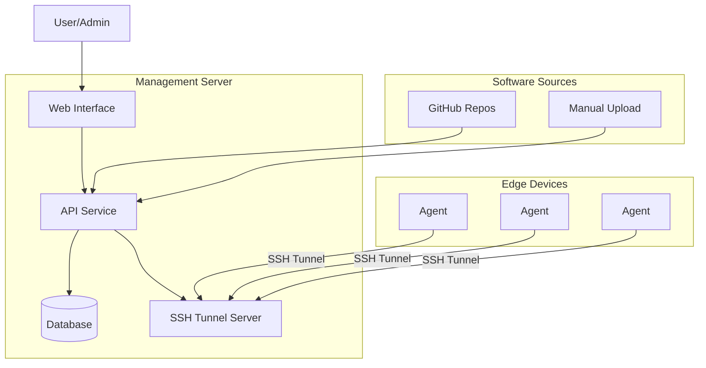
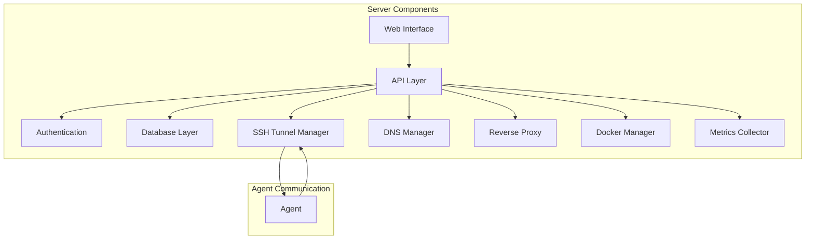
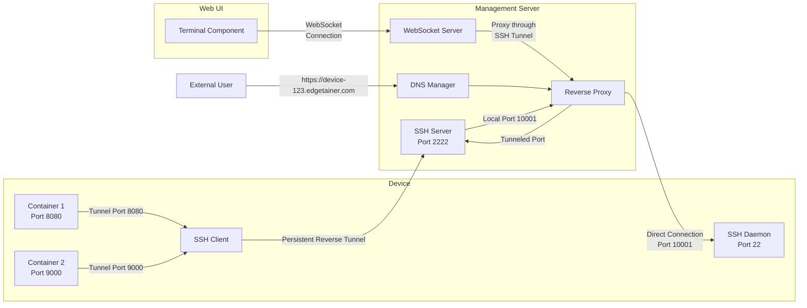
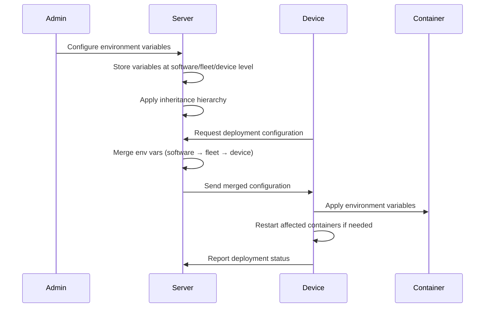
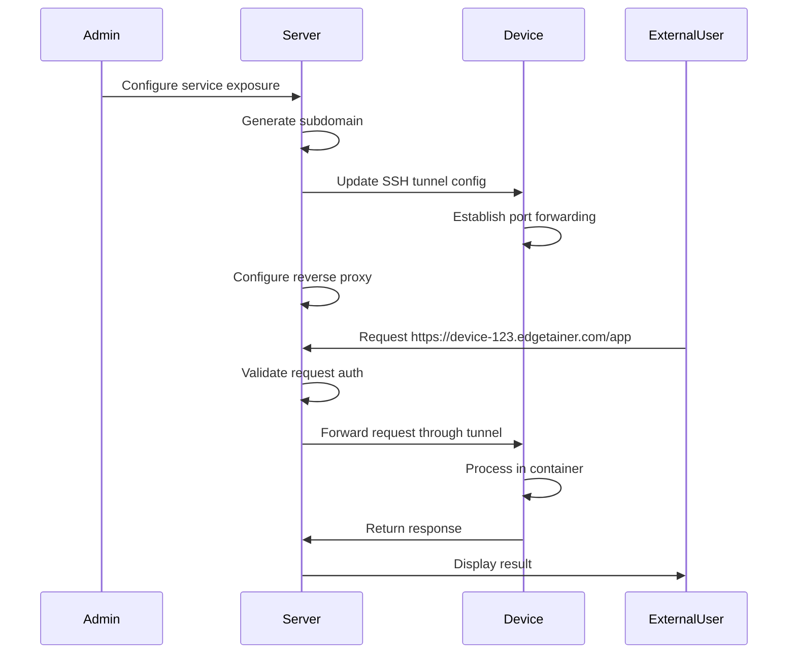
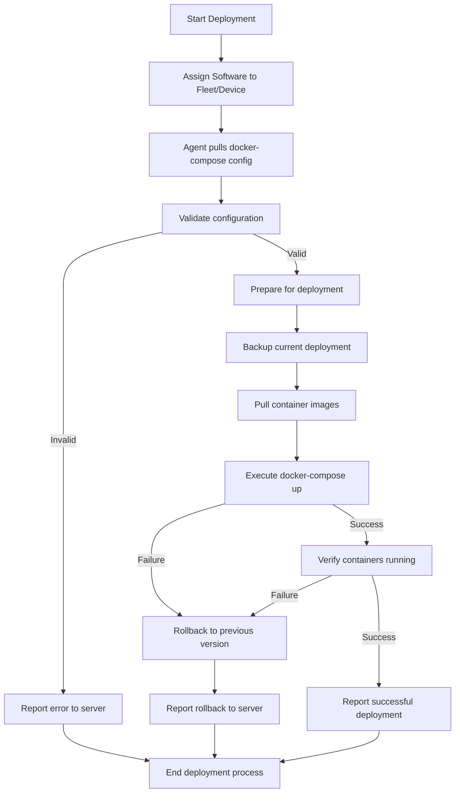
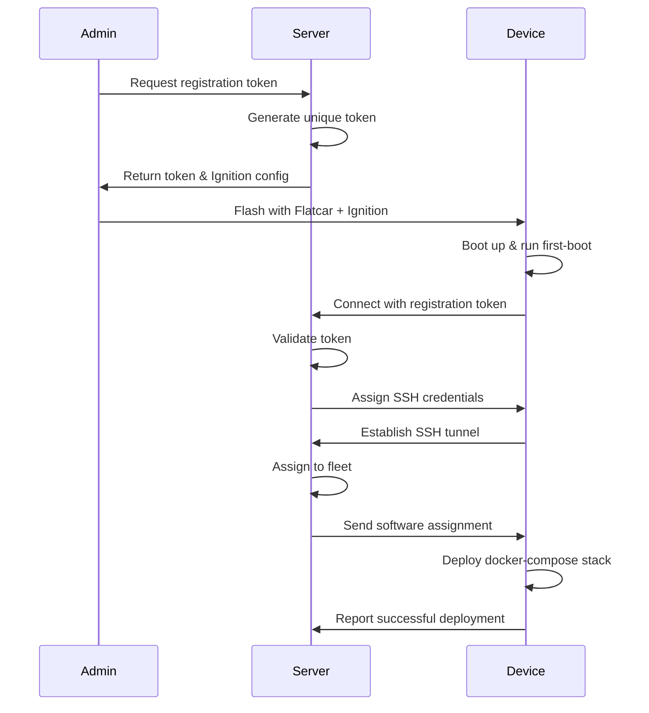

# Edgetainer Technical Specification

This is a non-binding technical specification for the Edgetainer project. It outlines the architecture, components, and design decisions for the system. Changes and improvements are welcome. (like ssh tunnel vs. websocket, QUIC, etc.)

## Edge Device Fleet Management System - Technical Specification

## 1. System Overview



## 1. System Architecture Overview

The system consists of two primary Golang components:

1. **Management Server**

   - Central web application with API and frontend
   - Device and fleet management
   - Software repository and deployment management
   - User authentication and authorization
   - SSH tunnel management for device connectivity

2. **Device Agent**
   - Lightweight Go service running on Flatcar Linux
   - SSH tunnel connection to management server
   - Docker-compose management
   - Status reporting and health metrics
   - Command execution handler

## 2. Project Structure

### 2.1 Directory Structure

The project follows a clean separation of concerns with these main directories:

```
/
├── cmd/
│   ├── server/
│   │   └── main.go
│   └── agent/
│       └── main.go
├── internal/
│   ├── server/
│   │   ├── api/
│   │   ├── auth/
│   │   ├── db/
│   │   ├── ssh/
│   │   ├── docker/
│   │   └── metrics/
│   ├── agent/
│   │   ├── ssh/
│   │   ├── docker/
│   │   ├── metrics/
│   │   └── system/
│   └── shared/
│       ├── models/
│       ├── config/
│       ├── logging/
│       └── protocol/
└── web/
    └── (frontend assets - may be separate repository)
```

### 2.2 Management Server Components

### 2.2 Data Models

#### 2.2.1 Core Models

**User**

- ID (UUID)
- Username
- Email
- Password (hashed)
- Role (Admin, Operator, Viewer)
- Created/Updated timestamps

**Fleet**

- ID (UUID)
- Name
- Description
- Created/Updated timestamps

**Device**

- ID (UUID)
- DeviceID (unique identifier)
- Name
- FleetID (reference to Fleet)
- Status (Online, Offline, Updating, Error)
- LastSeen timestamp
- IPAddress
- OSVersion
- HardwareInfo (JSON)
- SSHPort (assigned port for tunnel)
- Subdomain (unique subdomain name)
- SubdomainEnabled (boolean)
- Created/Updated timestamps

**Software**

- ID (UUID)
- Name
- Source (GitHub, Manual)
- RepoURL (for GitHub)
- CurrentVersion
- Versions (JSON array)
- DockerComposeYAML
- DefaultEnvVars (JSON)
- Created/Updated timestamps

**Deployment**

- ID (UUID)
- SoftwareID (reference to Software)
- FleetID (reference to Fleet, nullable)
- DeviceID (reference to Device, nullable)
- Version
- Pinned (boolean)
- Status (Pending, Deployed, Failed)
- Created/Updated timestamps

### 2.3 Server Components



#### 2.3.1 Database Layer

- Use GORM for database ORM
- PostgreSQL database
- Migration system for schema updates
- Transaction support for critical operations

#### 2.3.2 API Layer

**REST API Endpoints**

Authentication:

- `POST /api/auth/login` - User login
- `POST /api/auth/logout` - User logout
- `GET /api/auth/me` - Get current user info

User Management:

- `GET /api/users` - List users
- `POST /api/users` - Create user
- `GET /api/users/:id` - Get user details
- `PUT /api/users/:id` - Update user
- `DELETE /api/users/:id` - Delete user

Fleet Management:

- `GET /api/fleets` - List fleets
- `POST /api/fleets` - Create fleet
- `GET /api/fleets/:id` - Get fleet details
- `PUT /api/fleets/:id` - Update fleet
- `DELETE /api/fleets/:id` - Delete fleet
- `GET /api/fleets/:id/devices` - List devices in fleet

Device Management:

- `GET /api/devices` - List all devices
- `POST /api/devices` - Register new device
- `GET /api/devices/:id` - Get device details
- `PUT /api/devices/:id` - Update device
- `DELETE /api/devices/:id` - Delete device
- `POST /api/devices/:id/move` - Move device to another fleet
- `GET /api/devices/:id/status` - Get live device status
- `POST /api/devices/:id/restart` - Restart device
- `POST /api/devices/:id/command` - Execute command on device

Exposed Services Management:

- `GET /api/devices/:id/exposed-services` - List all exposed services for a device
- `POST /api/devices/:id/exposed-services` - Create new exposed service
- `GET /api/devices/:id/exposed-services/:service_id` - Get exposed service details
- `PUT /api/devices/:id/exposed-services/:service_id` - Update exposed service
- `DELETE /api/devices/:id/exposed-services/:service_id` - Delete exposed service
- `POST /api/devices/:id/exposed-services/:service_id/enable` - Enable exposed service
- `POST /api/devices/:id/exposed-services/:service_id/disable` - Disable exposed service

Software Management:

- `GET /api/software` - List software
- `POST /api/software` - Create new software entry
- `POST /api/software/upload` - Upload docker-compose file
- `GET /api/software/:id` - Get software details
- `PUT /api/software/:id` - Update software
- `DELETE /api/software/:id` - Delete software
- `POST /api/software/:id/deploy` - Deploy to fleet or device
- `GET /api/software/:id/versions` - List versions
- `GET /api/software/:id/env-vars` - Get default environment variables
- `PUT /api/software/:id/env-vars` - Update default environment variables

Environment Variable Management:

- `GET /api/fleets/:id/env-vars` - List all fleet environment variables
- `GET /api/fleets/:id/env-vars/:container` - Get fleet environment variables for a container
- `PUT /api/fleets/:id/env-vars/:container` - Update fleet environment variables for a container
- `DELETE /api/fleets/:id/env-vars/:container` - Delete fleet environment variables for a container

- `GET /api/devices/:id/env-vars` - List all device environment variables
- `GET /api/devices/:id/env-vars/:container` - Get device environment variables for a container
- `PUT /api/devices/:id/env-vars/:container` - Update device environment variables for a container
- `DELETE /api/devices/:id/env-vars/:container` - Delete device environment variables for a container
- `POST /api/devices/:id/env-vars/:container/restart` - Restart container after env var update

Provisioning:

- `GET /api/provision/config/:token` - Get Ignition config
- `POST /api/provision/register` - Register new device

Agent Communication:

- `POST /api/agent/heartbeat` - Device check-in
- `GET /api/agent/config` - Get agent configuration
- `POST /api/agent/status` - Report status
- `GET /api/agent/software` - Get assigned software

#### 2.3.3 SSH Tunnel Management

- SSH server implementation using golang.org/x/crypto/ssh
- Port assignment and management for device tunnels
- Session tracking and monitoring
- Channel for command execution
- Automatic reconnection handling
- Authentication via device-specific keys

#### 2.3.4 Web Frontend

- Serve static SPA (React or Vue.js)
- WebSocket for real-time updates
- Terminal via WebSocket proxy to SSH connections
- Container management UI

### 2.4 Authentication System

- JWT token-based authentication
- Role-based access control (RBAC)
- Token refresh mechanism
- Device-specific authentication for agents
- Session management

### 2.5 Subdomain-Based Access

- DNS manager for dynamic subdomain generation
- Reverse proxy for routing requests to device services
- Subdomain assignment per device (e.g., device-123.edgetainer.com)
- Optional service-specific subdomains (e.g., app.device-123.edgetainer.com)
- TLS termination and certificate management
- Access control rules for exposed services

### 2.6 Provisioning System

- Ignition configuration generation
- Unique device token generation
- Device registration workflow
- First-boot configuration

## 3. Device Agent Components

### 3.1 Agent Structure

The agent is a Golang application using the project structure defined in section 2.1, with these specific packages:

- `cmd/agent`: Main application entry point
- `internal/agent/config`: Agent-specific configuration management
- `internal/agent/ssh`: SSH tunnel client
- `internal/agent/docker`: Docker-compose operations
- `internal/agent/metrics`: System metrics collection
- `internal/agent/command`: Command execution handler
- `internal/agent/system`: System operations (restart, etc.)
- `internal/shared/*`: Shared components with server

### 3.2 Agent Functionality

#### 3.2.1 Configuration Management

- Local config file in YAML or JSON
- Environment variable overrides
- Persistent device identity
- Server connection information

#### 3.2.2 SSH Tunnel Client

- Establish persistent SSH tunnel to management server
- Automatic reconnection with exponential backoff
- Local port forwarding for remote access
- Command channel for receiving instructions
- Heartbeat mechanism

#### 3.2.3 Docker Compose Manager

- Parse and validate docker-compose files
- Execute docker-compose commands
- Monitor container status
- Handle updates and rollbacks
- Log collection and forwarding

#### 3.2.4 Metrics Collection

- System resource usage (CPU, memory, disk)
- Container status and health
- Network connectivity
- Application-specific metrics
- Regular reporting to management server

#### 3.2.5 Command Execution

- Remote command execution interface
- Shell command wrapper
- Docker container specific commands
- Output capturing and forwarding
- Security controls on allowed commands

### 3.3 Bootstrap Process

- First-boot detection
- Registration with management server
- Key exchange for secure communication
- Initial software deployment
- Status reporting

## 4. Communication Protocol

### 4.1 SSH Tunnel Implementation



- Management server runs SSH server on dedicated port
- Devices establish reverse SSH tunnels to server
- Each device is assigned a unique local port on server
- Server can connect to device through local port
- Container ports are exposed through SSH tunnel
- DNS manager creates device-specific subdomains
- Reverse proxy routes subdomain requests to appropriate device port
- WebSocket to SSH proxy for web terminal access

### 4.2 Data Exchange

- REST API for configuration and status updates
- SSH channels for command execution
- Structured JSON for data exchange
- Binary protocol for file transfers

### 4.3 Status Reporting

- Regular heartbeat messages
- Detailed system metrics
- Container status updates
- Event notifications
- Command execution results

## 5. Deployment Model

### 5.1 Environment Configuration Process



1. Admin defines default environment variables at the software level
2. Fleet-level variables can override or extend software defaults
3. Device-specific variables can override or extend fleet-level variables
4. Variables are merged with clear precedence: device > fleet > software defaults
5. When updating variables, containers can be restarted selectively
6. Environment variables can be used for:
   - API keys and credentials
   - Configuration settings
   - Feature flags
   - Connection strings
   - Regional settings
7. Secret values are encrypted in the database and logs

### 5.2 Service Exposure Process



1. Admin configures which container services to expose via the UI
2. Server assigns unique subdomain to the device if not already assigned
3. Server configures reverse proxy rules for the exposed service
4. Device establishes port forwarding through SSH tunnel
5. Server updates DNS records for the subdomain
6. External users can access the service via the subdomain
7. Optional path-based routing for multiple services on same device
8. Authentication and authorization handled by the server
9. TLS termination occurs at the server level

### 5.2 Software Deployment Process



- Server assigns software to fleet or specific device
- Agent pulls docker-compose configuration
- Agent performs validation of configuration
- Agent executes docker-compose commands
- Status reporting during deployment
- Rollback capability on failure

### 5.2 Version Control

- Git integration for tracking configurations
- Version tagging and history
- Diff generation between versions
- Pinning specific versions to fleets or devices

## 6. Database Schema

### 6.1 Main Tables

```
users
  id UUID PRIMARY KEY
  username TEXT NOT NULL UNIQUE
  email TEXT NOT NULL UNIQUE
  password_hash TEXT NOT NULL
  role TEXT NOT NULL
  created_at TIMESTAMP NOT NULL
  updated_at TIMESTAMP NOT NULL

fleets
  id UUID PRIMARY KEY
  name TEXT NOT NULL
  description TEXT
  created_at TIMESTAMP NOT NULL
  updated_at TIMESTAMP NOT NULL

devices
  id UUID PRIMARY KEY
  device_id TEXT NOT NULL UNIQUE
  name TEXT NOT NULL
  fleet_id UUID REFERENCES fleets(id)
  status TEXT NOT NULL
  last_seen TIMESTAMP
  ip_address TEXT
  os_version TEXT
  hardware_info JSONB
  ssh_port INTEGER
  created_at TIMESTAMP NOT NULL
  updated_at TIMESTAMP NOT NULL

software
  id UUID PRIMARY KEY
  name TEXT NOT NULL
  source TEXT NOT NULL
  repo_url TEXT
  current_version TEXT
  versions JSONB
  docker_compose_yaml TEXT
  created_at TIMESTAMP NOT NULL
  updated_at TIMESTAMP NOT NULL

deployments
  id UUID PRIMARY KEY
  software_id UUID REFERENCES software(id)
  fleet_id UUID REFERENCES fleets(id)
  device_id UUID REFERENCES devices(id)
  version TEXT NOT NULL
  pinned BOOLEAN NOT NULL DEFAULT false
  status TEXT NOT NULL
  env_vars JSONB
  created_at TIMESTAMP NOT NULL
  updated_at TIMESTAMP NOT NULL

fleet_env_vars
  id UUID PRIMARY KEY
  fleet_id UUID REFERENCES fleets(id)
  container_name TEXT NOT NULL
  env_vars JSONB NOT NULL
  created_at TIMESTAMP NOT NULL
  updated_at TIMESTAMP NOT NULL

device_env_vars
  id UUID PRIMARY KEY
  device_id UUID REFERENCES devices(id)
  container_name TEXT NOT NULL
  env_vars JSONB NOT NULL
  created_at TIMESTAMP NOT NULL
  updated_at TIMESTAMP NOT NULL

device_logs
  id UUID PRIMARY KEY
  device_id UUID REFERENCES devices(id)
  log_type TEXT NOT NULL
  message TEXT NOT NULL
  created_at TIMESTAMP NOT NULL

api_tokens
  id UUID PRIMARY KEY
  user_id UUID REFERENCES users(id)
  token TEXT NOT NULL UNIQUE
  description TEXT
  expires_at TIMESTAMP
  created_at TIMESTAMP NOT NULL

exposed_services
  id UUID PRIMARY KEY
  device_id UUID REFERENCES devices(id)
  name TEXT NOT NULL
  container_name TEXT NOT NULL
  internal_port INTEGER NOT NULL
  external_port INTEGER NOT NULL
  protocol TEXT NOT NULL DEFAULT 'http'
  url_path TEXT
  auth_required BOOLEAN NOT NULL DEFAULT true
  enabled BOOLEAN NOT NULL DEFAULT true
  created_at TIMESTAMP NOT NULL
  updated_at TIMESTAMP NOT NULL
```

### 6.2 Indexes

```
CREATE INDEX idx_devices_fleet_id ON devices(fleet_id);
CREATE INDEX idx_devices_status ON devices(status);
CREATE INDEX idx_devices_last_seen ON devices(last_seen);
CREATE INDEX idx_deployments_software_id ON deployments(software_id);
CREATE INDEX idx_deployments_fleet_id ON deployments(fleet_id);
CREATE INDEX idx_deployments_device_id ON deployments(device_id);
CREATE INDEX idx_device_logs_device_id ON device_logs(device_id);
CREATE INDEX idx_device_logs_created_at ON device_logs(created_at);
```

## 7. User Interface Requirements

### 7.1 Dashboard

- Fleet overview with device counts
- Device status summary
- Recent activity log
- Quick action buttons

### 7.2 Fleet Management

- Fleet listing with search/filter
- Fleet creation and editing
- Device assignment interface
- Deployment status

### 7.3 Device Management

- Device listing with status indicators
- Device detail view with metrics
- Terminal access component
- Docker container management UI
- Logs viewer
- Exposed services configuration panel
  - Exposable container ports detection
  - Service naming and path configuration
  - Authentication settings
  - URL/Subdomain display
  - Enable/disable controls

### 7.4 Software Management

- Software repository list
- Version history view
- Deployment configuration
- GitHub integration setup
- Default environment variables editor
  - Key-value pair input
  - Secret value masking
  - Variable descriptions
  - Variable grouping by container

### 7.5 Environment Variables Management

- Hierarchical display showing inheritance (software → fleet → device)
- Color-coded visualization of overridden values
- Fleet-level variable configuration
- Device-specific variable configuration
- Container restart controls when updating variables
- Secret value management
- Variable history and audit log
- Import/export functionality

### 7.6 User Management

- User listing
- User creation/editing
- Role assignment
- API token management

## 8. Provisioning Flow

### 8.1 Device Registration Process



1. Generate unique registration token
2. Create Ignition configuration with token
3. Flash Flatcar Linux with Ignition config to device
4. Device boots and runs first-boot script
5. Agent connects to server with registration token
6. Server validates token and registers device
7. Server assigns SSH credentials to device
8. Device establishes persistent SSH tunnel
9. Server assigns software based on rules
10. Device deploys assigned software

### 8.2 Ignition Configuration

- Base Flatcar configuration
- Network settings
- User accounts and SSH keys
- Agent installation and configuration
- Registration token
- First-boot scripts
